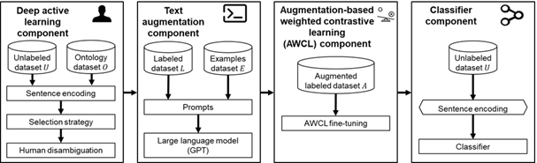

# Strategic-Intelligence-LLM

# DECODA: Semantic-Based Deductive Content Analysis for Strategic Innovation

## Overview

While mandatory **10-K filings** are a goldmine for financial analysts, the most critical signals regarding a firm’s innovation strategy are often absent from the numeric tables. Traditional indicators like R&D spending or patent counts fail to distinguish between **exploration** (the discovery of new markets) and **exploitation** (improving existing efficiency). 

Instead, these vital strategic insights are buried within the unstructured text of the "Business" section, where executives discuss new product launches and market developments. However, manually sifting through thousands of reports to find these nuances is a non-scalable task, and basic keyword-search tools lack the semantic depth to interpret complex professional language. 

This research introduces **DECODA**, a semantic framework that automates this analysis by mapping corporate narratives to validated innovation measures with high precision.

## Methodology

[cite_start]The study analyzed a massive dataset of **10,480 10-K reports** from **1,048 manufacturing firms** over a ten-year period, sourced directly from the SEC's EDGAR database. The DECODA framework streamlines the analysis through a three-stage process:

* **Deep Active Learning:** A "human-in-the-loop" component that identifies the most informative sentences for expert verification, minimizing the manual effort required.
* **Text Augmentation:** Using Large Language Models (LLMs) to synthetically expand the training data, ensuring the model understands various ways a strategic point can be phrased.
* **Weighted Contrastive Learning (AWCL):** A novel fine-tuning technique that helps the model distinguish between sentences with similar phrasing but opposite meanings, such as opening versus closing a branch.

*Figure 3: The DECODA framework architecture combining Deep Active Learning, Text Augmentation, and AWCL.*

*Figure 4: Comparison between traditional contrastive loss and the proposed Augmentation-based Weighted Contrastive Loss (AWCL).*

## Results

The evaluation demonstrates that DECODA significantly outperforms a wide range of state-of-the-art models, achieving an **AUC=0.813** and a classification **accuracy of 0.758**. These results were **14.4% better in AUC** than standard large language models like GPT-3. 

When specifically comparing performance metrics, DECODA achieved an **F1 score of 0.790**, representing a **42.1% improvement over GPT-3** (F1=0.556) and a **35.5% improvement over GPT-4** (F1=0.583) in this deductive coding task. 

Crucially for industry applications, the framework reduced manual labeling effort by **99.7%**. Furthermore, unlike generative chatbots that can produce inconsistent results across sessions, DECODA provides a reproducible and scalable solution for analyzing hundreds of thousands of sentences across entire industries.

### Performance Tables

**Table 5: Benchmark Evaluation against State-of-the-Art Models**

| Model Type | Method | AUC | Accuracy |
| :--- | :--- | :--- | :--- |
| **Baseline** | ROBERTa | 0.555 | 0.420 |
| **Sentence Transformers** | SROBERTa | 0.714 | 0.590 |
| **Contrastive Learning** | SimCSE | 0.683 | 0.564 |
| **LLM** | GPT-3 | 0.711 | 0.576 |
| **Proposed Method** | **DECODA** | **0.813** | **0.758** |

**Table 6: Comparison against GPT-4 (ChatGPT)**

| Metric | GPT-4 | DECODA |
| :--- | :--- | :--- |
| **Accuracy** | 0.675 | **0.758** |
| **F1 Score** | 0.583 | **0.790** |
| **Precision** | **0.800** | 0.733 |
| **Recall** | 0.459 | **0.876** |

---
